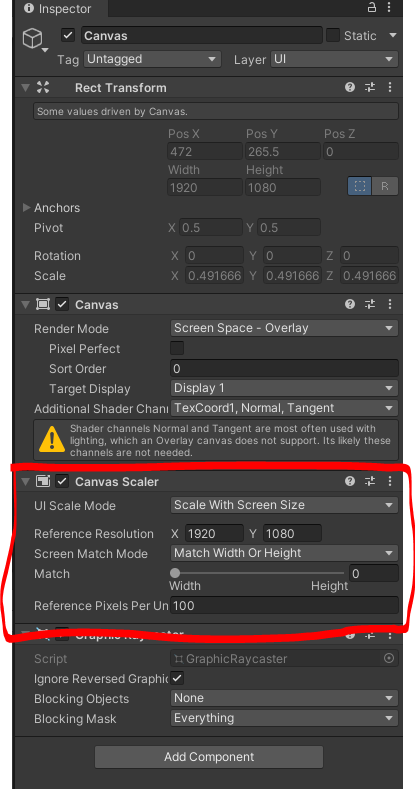
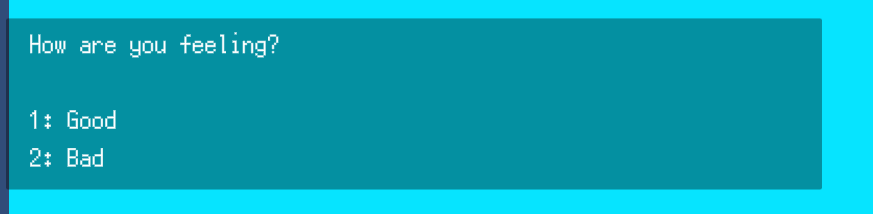

# GoodbyeGame_Oct22Jam

Trello: https://trello.com/b/nR2pGjQ9/game-jam-10-2022


## Dialog

### Adding the Dialog Box to your Scene
In order to put dialog in the scene, you have to put the DialogBox prefab in your scene, under a Canvas (the Canvas should have the following settings for its **Canvas Scaler**):


### Adding Dialog to your game
Assuming the Dialog Box has been added to the scene (see above), you can add Dialog to the game with the following code.

### Showing a single line of dialog
```C#
// you don't have to have this using statement,
// but it makes the code a lot less verbose
using DialogController = UI.Controllers.DialogController;

private void Start()
{
    string dialog = "Hello, here is some sample dialog!";
    DialogController.instance.ShowDialog(dialog);
}
```

### Showing multiple lines of dialog
```C#
using DialogController = UI.Controllers.DialogController;

private void Start()
{
    string[] dialog = new string[] {
        "Ahoy there, coder!",
        "Here's some sample dialog with multiple lines.",
        "The Dialog Controller will show all of them, waiting for the player to press 'space' to proceed"
    };
    DialogController.instance.ShowDialog(dialog);
}
```

### Using dialog choices
In order to use choices in your dialog, you have to use some special syntax.
Let's take a look at an example: 
`{CHOICE}How are you feeling? {CHOICES: Good | Bad }` <br/>
will show to the player as: 

To add more choices you can just keep adding, for example: <br/>
`{CHOICE}How are you feeling? {CHOICES: Here | Are | More | Choices | Etc }` <br/><br/>
After we've given the player some choices, on the very next line we can show different responses based on the choices they've selected.<br/><br/>
To do this, we declare the line as "Decisions", and show the following syntax:<br/>
`{DECISIONS: I'm glad | Oh no!}`<br/>
For the above, if the player pressed "1" for the options pictured above, the dialog will show "I'm glad"; and if they pressed "2" if will show "Oh no!"<br/><br/>
```C#
using DialogController = UI.Controllers.DialogController;

private void Start()
{
    string[] dialog = new string[] {
        "{CHOICE}How are you feeling? {CHOICES: Good | Bad }", // you have to declare this is a choice, and include the choices in the same line
        "{DECISIONS: I'm glad you're feeling good | Oh no! Feel better.}" // and on the following line, you can show the corresponding decision paths
    };
    DialogController.instance.ShowDialog(dialog);
}
```